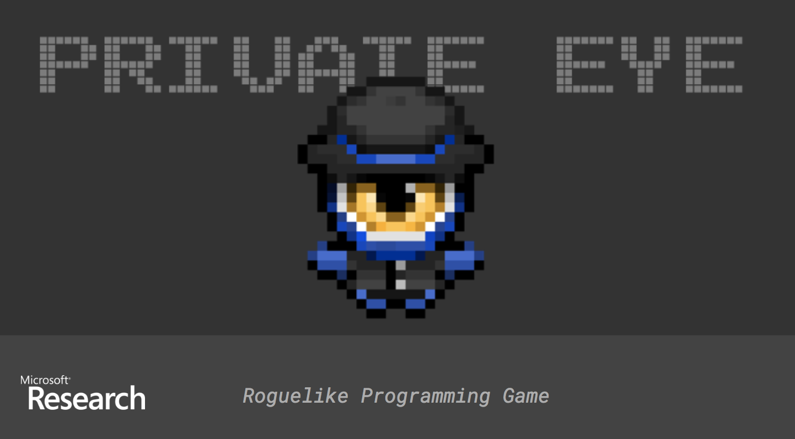
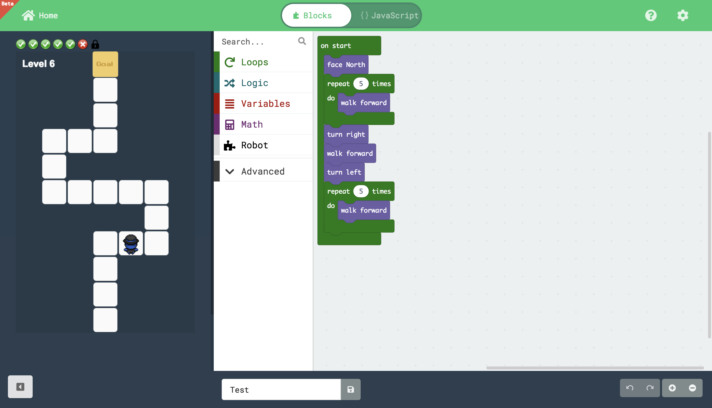
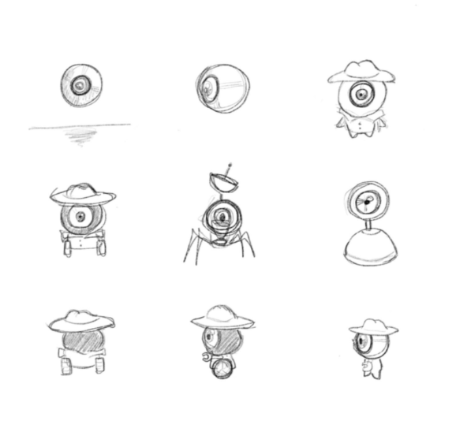
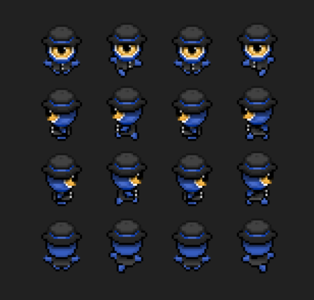

# Private Eye - Cornell MPS project Team

This repo contains a maze game designed to teach programming built with [Microsoft MakeCode](https://github.com/Microsoft/pxt). Players can drag code blocks to playground to build their own logic and program the robot to reach the goal. Especially, this is a level game where users need to think of using one block of code to pass all the levels.

- Try it alive: [https://zh324.github.io/Private-Eye](https://zh324.github.io/Private-Eye)
- More makecode examples: [Makecode Labs](https://makecode.com/labs)

## Game Preview



## API design

* Current API functions: 
```
walkForward(), turnLeft(), turnRight(), faceNorth(), faceSouth(), faceWest(), faceEast()
```
* TODOs:
```
wallAhead(), Breadth First Search
```
## Code example
 ```
  // This piece of code can pass through up to level 6
  
   Robot.faceUp()
   for (let i = 0; i < 5; i++) {
       Robot.moveForward()
   }
   Robot.turnRight()
   Robot.moveForward()
   Robot.turnLeft()
   for (let i = 0; i < 5; i++) {
       Robot.moveForward()
   }
 ```
## Charater design




## Running locally

These instructions allow to run locally to play the game.

### Setup

The following commands are a 1-time setup after synching the repo on your machine.

* install [node.js](https://nodejs.org/en/)

* install the PXT command line
```
npm install -g pxt
```
* install the dependencies
```
npm install
```

### Running the local server

After you're done, simple run this command to open a local web server:
```
pxt serve
```

After making a change in the source, refresh the page in the browser.

## Updating the tools

If you would like to pick up the latest PXT build, simply run
```
pxt update
```

More instructions at https://github.com/Microsoft/pxt#running-a-target-from-localhost 
